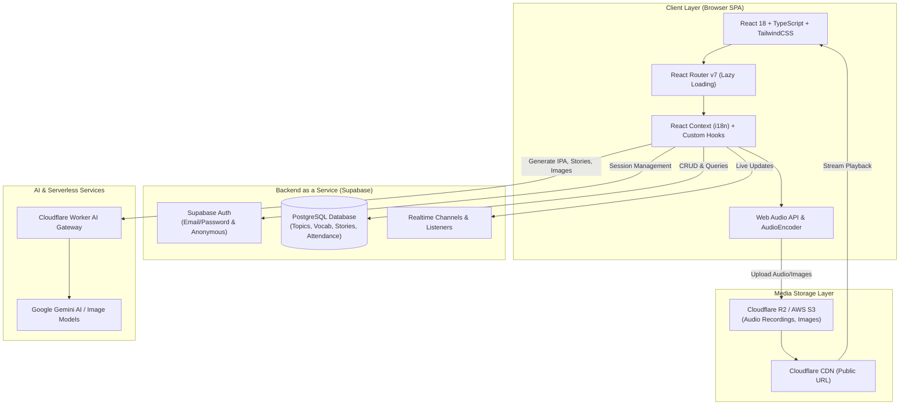
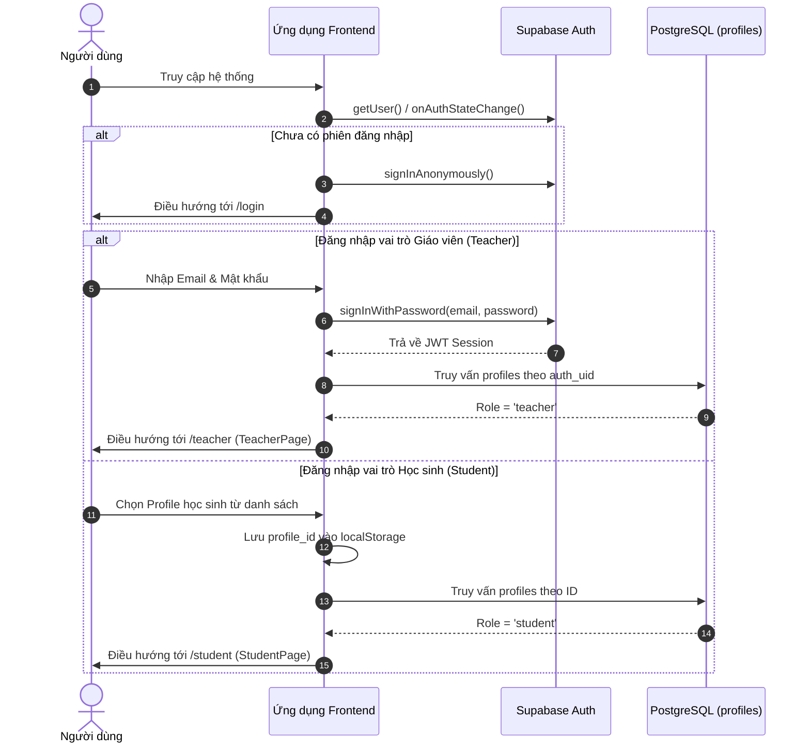
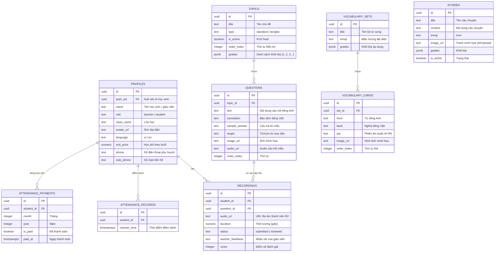
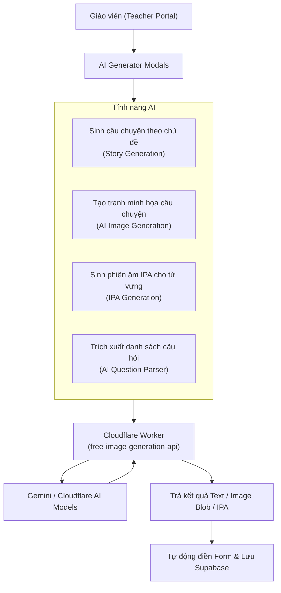
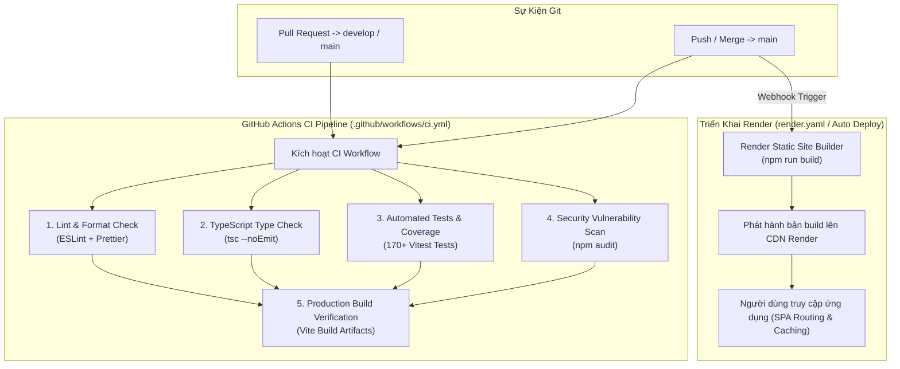

# Kiến Trúc Hệ Thống - English Record (Architecture Guide)

Tài liệu này cung cấp cái nhìn toàn diện và chuyên sâu về thiết kế kiến trúc, luồng dữ liệu, mô hình xác thực, cấu trúc cơ sở dữ liệu và các tích hợp bên ngoài của nền tảng **English Record**.

---

## 1. Tổng quan Kiến trúc (High-Level Architecture)

**English Record** được xây dựng theo mô hình **Single Page Application (SPA)** hiện đại, tận dụng hệ sinh thái Serverless (Supabase, Cloudflare R2, Cloudflare Workers) giúp tối ưu hiệu năng, chi phí vận hành và khả năng mở rộng.



---

## 2. Công nghệ Cốt lõi (Tech Stack)

| Thành phần | Công nghệ / Thư viện | Vai trò |
| :--- | :--- | :--- |
| **Frontend Framework** | React 18 (TypeScript) | Xây dựng giao diện tương tác tốc độ cao, type-safe |
| **Build Tool & Server** | Vite 6 | Fast HMR, bundle tối ưu cho môi trường production |
| **Styling** | TailwindCSS 3, Lucide React | Hệ thống utility classes hiện đại, responsive, icon phong phú |
| **Routing** | React Router v7 | Điều hướng client-side, code-splitting (lazy loading) |
| **Database & Auth** | Supabase (PostgreSQL, GoTrue) | Quản lý người dùng, bảng dữ liệu quan hệ, realtime |
| **Media Storage** | Cloudflare R2 / AWS S3 SDK | Lưu trữ file ghi âm học viên, tranh minh họa từ vựng/truyện |
| **AI Integration** | Cloudflare Workers, Gemini API | Sinh câu chuyện, ảnh minh họa tự động, tạo phiên âm IPA |
| **Audio Processing** | Web Audio API, Custom WAV/WebM Encoder | Thu âm, nén âm thanh phía client, giảm tải băng thông |
| **Testing** | Vitest, Happy-DOM | Kiểm thử tự động đơn vị (Unit testing) |
| **Code Quality** | ESLint 10, Prettier, TypeScript 5.6 | Kiểm tra lỗi cú pháp, chuẩn hóa format code |

---

## 3. Mô hình Xác thực & Phân quyền (Authentication & Authorization)

Hệ thống hỗ trợ 2 vai trò người dùng chính với cơ chế xác thực riêng biệt:



### Các trạng thái phân quyền:
1. **Teacher (Giáo viên)**:
   - Xác thực qua email/mật khẩu tại Supabase Auth.
   - Có toàn quyền quản trị: Thêm/sửa/xóa chủ đề, câu hỏi, thẻ từ vựng, truyện đọc, quản lý tài khoản học viên, chấm điểm bài thu âm, điểm danh và tính học phí.
2. **Student (Học sinh)**:
   - Không yêu cầu tạo tài khoản phức tạp. Học sinh chọn đúng hồ sơ lớp học của mình để truy cập.
   - Học sinh luyện nói, xem flashcards, chơi game, luyện shadowing, ghi âm bài tập và nộp bài.

---

## 4. Mô hình Dữ liệu (Database Schema)

Cơ sở dữ liệu PostgreSQL được lưu trữ và quản lý trên Supabase. Dưới đây là sơ đồ liên kết giữa các bảng:



---

## 5. Pipeline Xử lý m thanh & Lưu trữ Tệp (Audio Pipeline)

Để đảm bảo việc thu âm trên trình duyệt hoạt động ổn định và tệp gửi lên Cloudflare R2 có dung lượng nhẹ, hệ thống triển khai pipeline xử lý âm thanh tự động:

```mermaid
flowchart LR
    Mic["Microphone\n(MediaRecorder API)"] --> RawAudio["Raw Audio Blob\n(WebM / Audio Buffer)"]
    RawAudio --> Encoder["Audio Encoder\n(audioEncoder.ts)"]
    Encoder --> OptimizedBlob["Optimized Audio\n(MP3 / WAV / WebM Nén)"]
    OptimizedBlob --> Service["uploadService.ts\n(AWS SDK S3 Client)"]
    Service --> R2["Cloudflare R2 Bucket\n(S3 API compatible)"]
    R2 --> CDN["Public URL\n(pub-...r2.dev)"]
    CDN --> SupabaseRecord["Lưu audio_url vào\nBảng recordings"]
```



### Điểm đặc biệt của Audio Pipeline:
- **Kiểm soát dung lượng & MIME type**: [uploadService.ts](file:///Users/thanhlv/Documents/Projects/english-record/src/services/uploadService.ts) kiểm tra định dạng hợp lệ (JPG, PNG, WebM, MP3, WAV) và chặn tệp vượt quá dung lượng cho phép.
- **Client-Side Encoding**: Giúp nén âm thanh ngay tại máy người học trước khi upload, tiết kiệm băng thông và tăng tốc độ tải bài.

---

## 6. Tích hợp AI (AI & Cloudflare Workers Gateway)

Hệ thống tích hợp AI phục vụ trực tiếp cho quá trình soạn thảo tài liệu giảng dạy của giáo viên:



---

## 7. Cấu trúc Thư mục Mã nguồn (Source Code Directory Map)

```
english-record/
├── .github/
│   └── workflows/ci.yml       # CI Pipeline (Type check & ESLint)
├── docs/                      # Tài liệu dự án
│   ├── ARCHITECTURE.md        # Kiến trúc hệ thống chi tiết (file này)
│   └── ONBOARDING.md          # Hướng dẫn dành cho developer mới
├── public/                    # Tài nguyên tĩnh (Favicon, manifest, offline assets)
├── src/
│   ├── components/            # UI Components chia theo module
│   │   ├── common/            # Components dùng chung (AudioPlayer, YouTubePlayer, OfflineBanner...)
│   │   ├── student/           # Giao diện học sinh (exercises, flashcards, games, shadowing, stories...)
│   │   └── teacher/           # Giao diện giáo viên (attendance, topics, vocabulary, stories, students...)
│   ├── data/                  # Dữ liệu tĩnh / Seed data
│   ├── hooks/                 # Custom React Hooks dùng chung (online status, scroll lock, keyboard shortcuts)
│   ├── i18n/                  # Hệ thống đa ngôn ngữ (LanguageContext, en.ts, vi.ts)
│   ├── lib/                   # Khởi tạo SDK bên thứ 3 (supabase.ts, s3.ts)
│   ├── pages/                 # Các trang chính (LoginPage, StudentPage, TeacherPage)
│   ├── services/              # Business logic & gọi API (topicService, vocabularyService, storyService, uploadService)
│   ├── test/                  # Cấu hình setup kiểm thử Vitest
│   ├── types/                 # Định nghĩa TypeScript Types / Interfaces
│   ├── utils/                 # Hàm tiện ích (audioEncoder, validators, streak, format, prizes)
│   ├── App.tsx                # Main App Router & Root Authentication State
│   └── main.tsx               # Điểm khởi chạy React DOM
├── .env.example               # Mẫu biến môi trường
├── package.json               # Dependencies & Scripts
├── tailwind.config.js         # Cấu hình giao diện TailwindCSS
├── vite.config.ts             # Cấu hình Vite Build Tool
└── vitest.config.ts           # Cấu hình Unit Test Runner
```

---

## 8. Chiến lược Xử lý Ngoại lệ & Bảo mật (Security & Resilience)

1. **Input Validation**: Mọi dữ liệu đầu vào (tên học sinh, số điện thoại, tiêu đề chủ đề, nội dung câu hỏi) đều được kiểm tra chặt chẽ thông qua [validators.ts](file:///Users/thanhlv/Documents/Projects/english-record/src/utils/validators.ts) và Zod Schemas.
2. **Offline Detection**: Hệ thống sử dụng hook `useOnlineStatus` kết hợp component `OfflineBanner` để cảnh báo kịp thời cho học sinh khi mất kết nối mạng.
3. **Graceful Auth Timeout**: Trường hợp kết nối tới Supabase Auth bị trễ, `App.tsx` có cơ chế timeout 5 giây ngăn chặn việc ứng dụng bị treo ở màn hình loading vô hạn.

---

## 9. Quy Trình CI & Triển Khai (CI Pipeline & Render Deployment)

Hệ thống tích hợp quy trình **Continuous Integration (CI)** tự động thông qua GitHub Actions kết hợp cùng **Auto-Deploy trên Render**:



### Chi tiết các tầng kiểm thử trong CI:
- **Lint & Format**: Kiểm tra quy chuẩn cú pháp JavaScript/TypeScript và định dạng Prettier (`format:check`).
- **Type Check**: Chạy `tsc --noEmit` xác thực toàn bộ kiểu dữ liệu mà không cần tạo file build.
- **Unit Tests & Coverage**: Chạy toàn diện bộ test cases với Vitest, đo lường độ bao phủ mã nguồn (>90%) và lưu trữ artifact 14 ngày.
- **Security Audit**: Quét các lỗ hổng bảo mật cấp cao và nghiêm trọng từ dependencies.
- **Production Build**: Biên dịch bundle thực tế, kiểm tra kích thước chunk và tính hợp lệ của mã đóng gói.

### Cơ chế Deploy trên Render:
- Ứng dụng được cấu hình qua file `render.yaml` theo dạng **Static Site**.
- **SPA Routing Rewrite**: Mọi request tới URL nhánh con được điều hướng tự động về `index.html` (`/* -> /index.html`).
- **Asset Caching**: Các file trong `/assets/` được áp dụng header `Cache-Control: public, max-age=31536000, immutable`.
- **Biến môi trường**: Được quản lý an toàn qua Render Dashboard Environment Variables.

