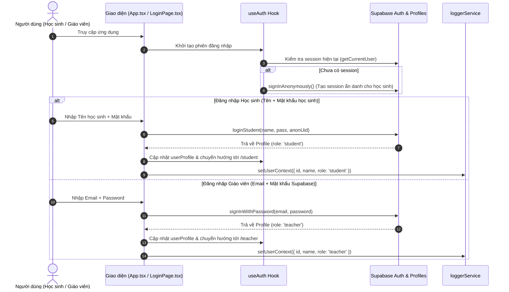
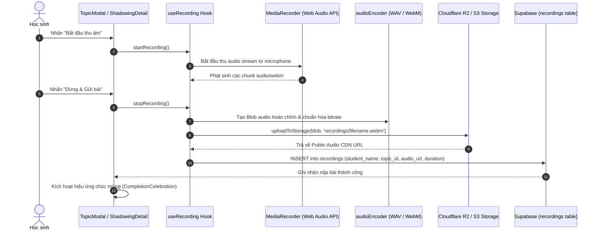
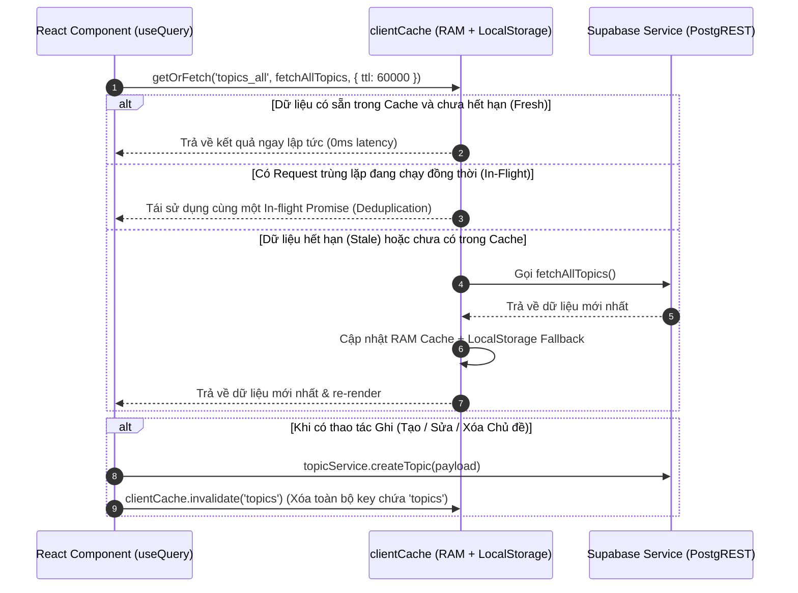
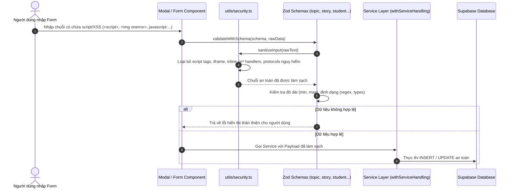
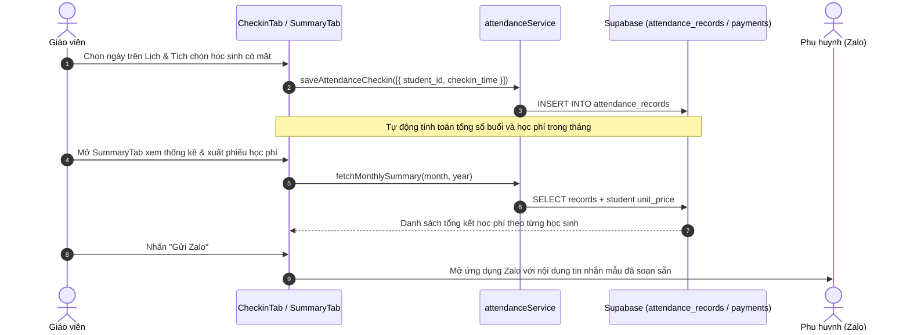
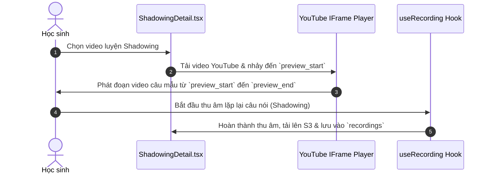
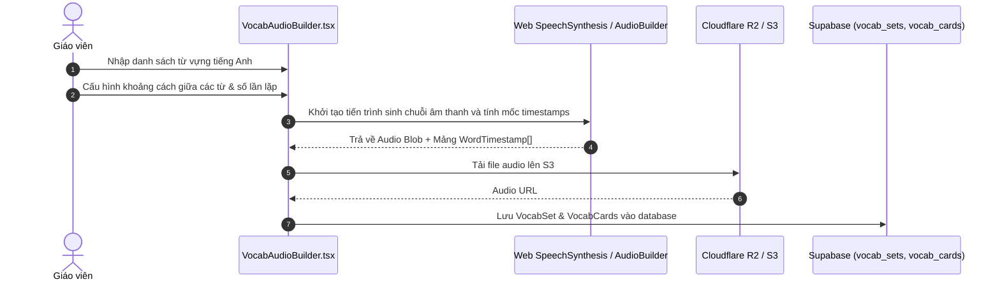
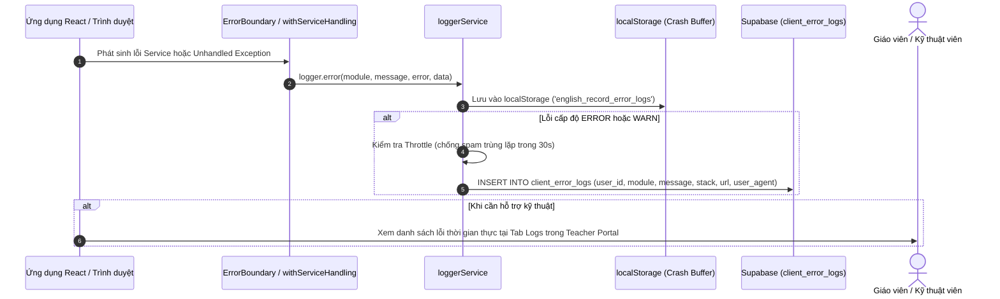

# Tài Liệu Thiết Lập Môi Trường & Luồng Dữ Liệu (Environment Setup & Data Flows)

Tài liệu này cung cấp hướng dẫn toàn diện về cách thiết lập môi trường phát triển, giải thích chi tiết các biến môi trường, cấu trúc database, các tài nguyên tĩnh trong thư mục `public/` và toàn bộ **8 Luồng Dữ Liệu (Data Flows)** cốt lõi của hệ thống **English Record**.

---

## 1. Thiết Lập Môi Trường (Environment Setup)

### A. Yêu Cầu Tiên Quyết
- **Node.js**: Phiên bản `>= 18.0.0` (Khuyến nghị Node.js 20 hoặc 22 LTS).
- **Trình quản lý gói**: `npm` hoặc `pnpm`.
- **Cơ sở dữ liệu**: Dự án Supabase (PostgreSQL + Auth + Storage).
- **Lưu trữ Audio**: Cloudflare R2 (hoặc AWS S3 tương thích).

---

### B. Bảng Cấu Hình Biến Môi Trường (`.env`)

Sao chép `.env.example` thành `.env` và cấu hình các biến sau:

| Tên Biến | Bắt Buộc | Mô Tả & Mục Đích | Ví Dụ Giá Trị |
| :--- | :---: | :--- | :--- |
| `VITE_SUPABASE_URL` | **Có** | Endpoint kết nối API của dự án Supabase | `https://xxxx.supabase.co` |
| `VITE_SUPABASE_ANON_KEY` | **Có** | Khóa công khai (Anon Key) dùng cho client-side | `eyJhbGciOiJIUzI1NiIsIn...` |
| `VITE_S3_ENDPOINT` | **Có** | Endpoint S3 API của Cloudflare R2 | `https://<account_id>.r2.cloudflarestorage.com` |
| `VITE_S3_REGION` | **Có** | Vùng lưu trữ S3 (thường là `auto` cho R2) | `auto` |
| `VITE_S3_BUCKET` | **Có** | Tên Bucket chứa các file ghi âm học sinh | `english-recordings` |
| `VITE_S3_ACCESS_KEY_ID` | **Có** | Access Key ID có quyền ghi vào S3 Bucket | `0a1b2c3d4e5f...` |
| `VITE_S3_SECRET_ACCESS_KEY` | **Có** | Secret Access Key tương ứng | `9z8y7x6w5v4u...` |
| `VITE_S3_PUBLIC_URL` | **Có** | Public Domain hoặc Custom CDN URL để phát audio | `https://audio.myenglish.com` |
| `VITE_AI_API_KEY` | Tùy chọn | API Key cho AI Image Generation (Workers / Pollinations) | `sk-...` |

---

### C. Cấu Trúc Bảng Dữ Liệu Trên Supabase

1. **`profiles`**: Thông tin người dùng (`id`, `auth_uid`, `name`, `role`, `grade`, `avatar`, `language`, `password`).
2. **`topics`**: Danh mục chủ đề luyện nói (`id`, `title`, `type`, `grades`, `order_index`, `is_active`).
3. **`questions`**: Câu hỏi thuộc chủ đề (`id`, `topic_id`, `text`, `translation`, `sample_answer`, `target`, `image_url`, `audio_url`, `order_index`).
4. **`recordings`**: Bản ghi âm của học sinh (`id`, `student_name`, `topic_id`, `topic_number`, `audio_url`, `teacher_rating`, `teacher_feedback`, `student_reaction`, `status`).
5. **`stories`**: Câu chuyện đọc tiếng Anh (`id`, `title`, `type`, `content`, `emoji`, `image_url`, `grades`, `is_active`).
6. **`vocab_sets` & `vocab_cards`**: Bộ thẻ từ vựng (`title`, `front`, `back`, `ipa`, `image_url`, `audio_url`).
7. **`shadowing_videos`**: Video luyện nói theo phụ đề YouTube (`title`, `youtube_url`, `preview_start`, `preview_end`, `record_start`, `record_end`, `grades`, `is_active`).
8. **`attendance_students`**: Danh sách học sinh điểm danh (`name`, `class_name`, `unit_price`, `phone`, `zalo_phone`, `hoc_lieu_fee`, `note`).
9. **`attendance_records`**: Lịch sử điểm danh từng buổi (`student_id`, `checkin_time`).
10. **`attendance_payments`**: Lịch sử đóng học phí (`student_id`, `month`, `year`, `is_paid`, `paid_at`).
11. **`client_error_logs`**: Lịch sử log lỗi và chẩn đoán phía client (`user_id`, `level`, `module`, `message`, `stack`, `url`, `user_agent`).

---

### D. Cấu Trúc Tài Nguyên Thư Mục `public/`

| Tên File | Vai Trò & Mục Đích |
| :--- | :--- |
| [`public/manifest.json`](file:///Users/thanhlv/Documents/Projects/english-record/public/manifest.json) | Cấu hình PWA (Progressive Web App) cho phép cài đặt app lên màn hình chính |
| [`public/sw.js`](file:///Users/thanhlv/Documents/Projects/english-record/public/sw.js) | Service Worker xử lý Offline Caching, Cache Busting và lưu trữ tài nguyên tĩnh |
| [`public/icon.svg`](file:///Users/thanhlv/Documents/Projects/english-record/public/icon.svg) | Logo Vector của ứng dụng, hiển thị trên Favicon, Bookmark và Apple Touch Icon |
| [`public/_redirects`](file:///Users/thanhlv/Documents/Projects/english-record/public/_redirects) | Cấu hình Rewrite URL cho Cloudflare Pages / Netlify để hỗ trợ Client-Side Routing |

---

## 2. Chi Tiết Các Luồng Dữ Liệu (Core Data Flows)

---

### 🟢 Luồng 1: Xác Thực & Điều Hướng (Authentication & Authorization)



---

### 🟢 Luồng 2: Thu Âm, Mã Hóa & Tải Lên Đám Mây (Voice Recording & Audio Pipeline)



---

### 🟢 Luồng 3: Bộ Nhớ Đệm Client, Khử Trùng Lặp & SWR (`clientCache` & `useQuery`)



---

### 🟢 Luồng 4: Phòng Chống XSS & Khử Nhiễm Dữ Liệu Đầu Vào (Security Pipeline)



---

### 🟢 Luồng 5: Điểm Danh, Tính Học Phí & Chia Sẻ Zalo (Attendance & Tuition)



---

### 🟢 Luồng 6: Luyện Nói Shadowing & Phân Đoạn Video YouTube



---

### 🟢 Luồng 7: Tạo Bộ Từ Vựng & Sinh Âm Thanh / Timestamps (Vocab Audio Builder)



---

### 🟢 Luồng 8: Ghi Log Lỗi Phía Client & Chẩn Đoán Từ Xa (Client Logging)



---

## 3. Quy Trình Kiểm Tra & Triển Khai (CI / Verification)

Để đảm bảo toàn bộ mã nguồn tuân thủ tiêu chuẩn chất lượng cao nhất:

```bash
# 1. Kiểm tra format code bằng Prettier
npm run format:check

# 2. Kiểm tra toàn bộ kiểu dữ liệu TypeScript
npm run type-check

# 3. Quét mã nguồn với ESLint
npm run lint

# 4. Chạy toàn bộ 45+ unit test suites
npm run test

# 5. Xuất báo cáo độ phủ mã nguồn
npm run test:coverage

# 6. Biên dịch bản build production
npm run build

# Hoặc chạy kiểm tra toàn diện một lệnh duy nhất:
npm run check-all
```
